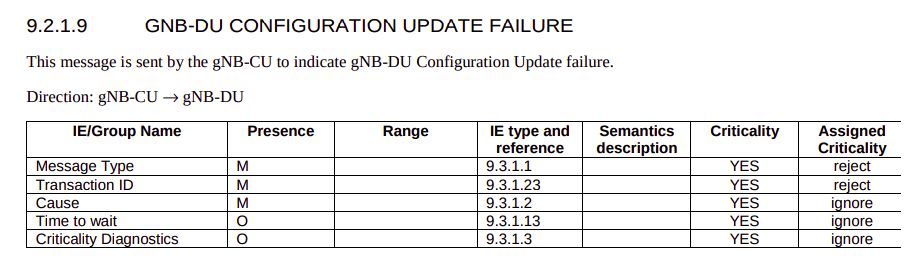
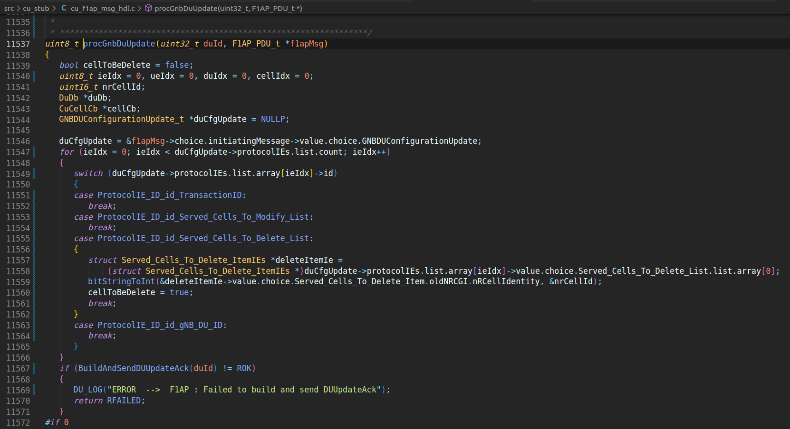

# DU Configuration Update 

[TS 38.473 Section 8.2.4](./TS-38.473.pdf)

## Standards Defination

### DU Configuration Update

## Elements for F1AP DU Configuration Update  

### DU Configuration Update

### DU Configuration Update Acknowledgement

### DU Configuration Update Failure

## Progress

### OSC DU-High

Currently, OAI DU-High only provides `Served Cells to Modify Lists IE` & `Served Cells to Delete Lists IE`.

`o-du-l2/src/du_app/du_f1ap_msg_hdl.c`

Then handling of only `Served Cells to Delete Lists IE` in **DU Configuration Update Acknowledgement** message:

### OSC CU STUB

Call Flow:

Handling of DU Configuration Update by OSC-CU:

Only handles the `Served Cells to Delete List` in processing DU Configuration Update in OSC-CU.

`o-du-l2/src/cu_stub/cu_f1ap_msg_hdl.c`

### OAI CU 

In OAI CU side, there are only macros for the **DU Configuration Update** message.

