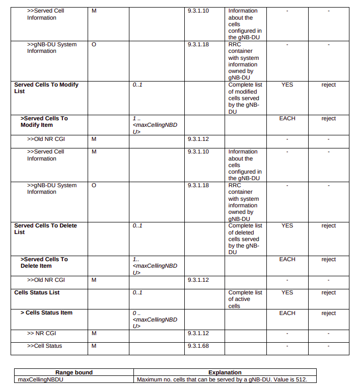
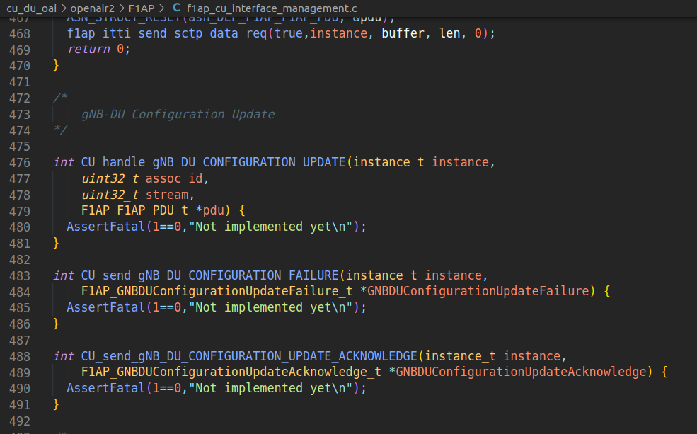

# Configuration Update 

## Standard Defination

3GPP Standard: [TS 38.473 Section 8.2.4](./TS-38.473.pdf)

### DU Configuration Update

## Elements for F1AP DU Configuration Update  

### DU Configuration Update

### DU Configuration Update Acknowledgement

### DU Configuration Update Failure

## Current Status

### OSC DU-High

Currently, OAI DU-High only provides `Served Cells to Modify Lists IE` & `Served Cells to Delete Lists IE`.

path: `o-du-l2/src/du_app/du_f1ap_msg_hdl.c`

Even, it only handles `Served Cells to Delete Lists` in **DU Configuration Update Acknowledgement** message.

### OSC CU STUB

Call Flow:

Handling of **DU Configuration Update** by OSC-CU:

path: `o-du-l2/src/cu_stub/cu_f1ap_msg_hdl.c`

Only handles the `Served Cells to Delete List` in processing **DU Configuration Update** in OSC-CU.

### OAI CU 

In OAI CU side, there are only macros for the **DU Configuration Update** message.

path: `openairinterface/openair2/F1AP/f1ap_cu_interface_management.c`

